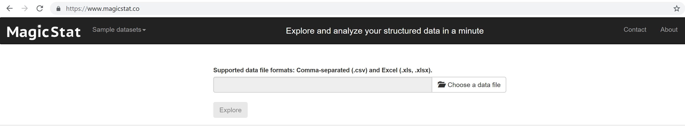
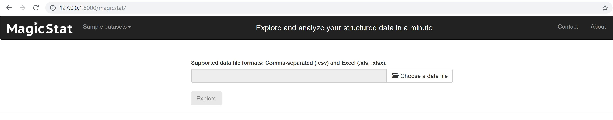

# MagicStat
MagicStat is a web-based statistical data analytics platform for people with little knowledge and experience in performing certain statistical models. In this repository, you can find the Django/Python source files and quick instructions to run the browser-based MagicStat application on your local environment.

The fact is that you don't have install it on your machine. Visit the link below for the web version.
# The web link: https://www.magicstat.co

   
      

We do NOT save your files but if you still have some data privacy issues, you can install it on your local machine as well. 

# Version:
   - 1.0.1
   - This version only supports correlation models (pearson, spearman's, kendall).
   - More models will be supported in the following versions.
   
# License
 - GNU General Public License version 3
   
# New Features!
  - Easy access via any web browser
  - User-friendly interface with rich visual analytics
  - Pearson correlation: a parametric test that measures the strength and direction of the relationship between two variables.
  - Cross-platform data import/export support: Comma-separated (.csv) and Microsoft Excel (.xls, .xlsx), data files.
  - More features coming soon.
  
# Installing MagicStat on your local machine

  1. Install Python 3.x on your local machine. For more info visit https://www.python.org/downloads/
  
  2. Install virtual environment on your local machine and start (activate) it. For more info visit https://virtualenv.pypa.io/en/latest/installation/
  
  Note: If you do not want to deal with a virtual environment you can skip this step and continue with the next one. However, we highly recommend you to install MagicStat in a virtual environment as it will prevent to change the settings of your global python environment.
  
  3. Generate a new directory on your local machine and download the files of this MagicStat repository under that directory.
  
  4. Open up your terminal/command window, go to the new directory you put the files in from this MagicStat repository, and run the following command: 
  
```python
pip install -r requirements.txt
```
  5. To make sure that every module (package) is installed, run
    
```python
pip freeze
```
You'll see a list of modules. If you see any missing module from the requirements.txt file, then simply run

```python
pip install the-missing-module-name
```
   
  6. You should have installed all the required modules. Now, run the local web server using the following command:
  
```python 
python manage.py runserver
```
   7. Open up a browser and type http://127.0.0.1:8000/magicstat/
   
   8. You should be able to see the following screen:

  
# Installing MagicStat for your own django project

If you want to integrate MagicStat with your own Django project, follow these steps:

1. Add "MagicStat" to your INSTALLED_APPS setting like this:
```python
    INSTALLED_APPS = [
        ...
        'MagicStat',
    ]
```
 2. Include the url of the MagicStat application in your project urls.py like this:
```python
    path('magicstat/', include('MagicStat.urls')),
```
3. The MagicStat application contains a static directory for storing static files. Include the url of that directory in the settings.py file like this:
```python
    STATIC_URL = '/static/'
```
4. Continue with the step 2 in 'Installing MagicStat on your local machine'.


